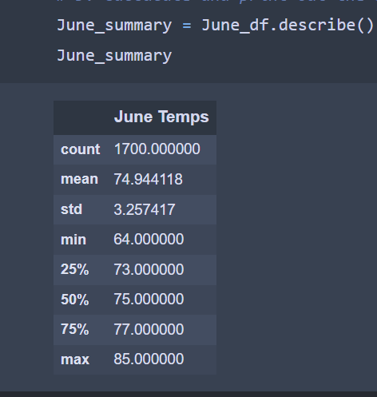
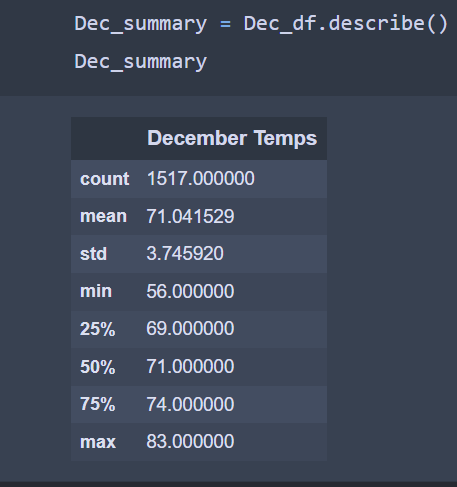
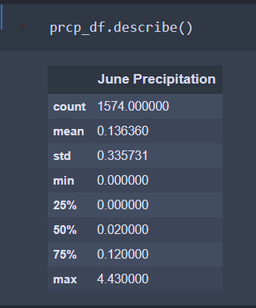
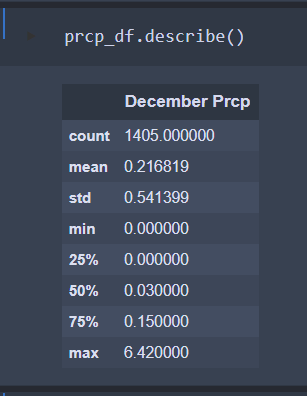

# surfs_up:

## Overview of the analysis:

### Our goal in this analysis was to provide W.Avy with more information about temperature trends in the island of Oahu, he is a potential investor who could help get our potential Surf n' Shake Shop off the ground. 
### Specifically, he asked for temperature data for the months of June and December in the island, in order to determine if the Surf n' Shake shop/business could be forseen as a sustainable business all year long.

### To complete this assignment, our analysis consisted of two technical analysis deliverables

* Deliverable 1: Determine the Summary Statistics for June
* Deliverable 2: Determine the Summary Statistics for December

### For both deliverables, we referred to Python, Pandas functions and methods, and SQLAlchemy. We filtered the date column of the Measurements table in the hawaii.sqlite database "initially provided to us" to retrieve all the temperatures for the months of June and December. We then converted those temperatures to a list, created a DataFrame from the list, and generated the summary statistics.

## Results:

### Below are the temperature statistics for each month:

### June 
   

### December

### The above statistics provide the below three major points:

* Temperature Low's:
    * The lowest temperature in the month of June is 64.0°f. However, in December lowest temperature is 56.0°f. 

* * Temperature High's:
    * The highest temperature in June is 85.0°f. However, in December the highest temperature is 83.0°f.

* Temperature Avg's: 
    * The month of December is cooler than June in Oahu, as the average temperature in June is 74.9°f while the average temperature in December is 71.0°f.

## Summary:

### Looking at the statistics from both months, it appears that both months have very close temperature statistics, and the difference in temps between the two months is fairly slight. In fact, the mean temperature in December is 4 degrees cooler than in June.
### While the lowest temp in Dec is fairly lower than in June, we believe our focus should be more focused on higher temps as the lowest temperatures in a day occur mainly during night time, when the shop will most likely be closed and not operating, so we do not forsee a negative impact due to the cold temps in this scenario.
### We also ran an extra query per each month to collect additional data on the levels of precipitation per month, below are the queries:

* session.query(Measurement.date, Measurement.prcp).filter(extract('month',Measurement.date)==6).all()
* session.query(Measurement.date, Measurement.prcp).filter(extract('month',Measurement.date)==12).all()

                       

* The lowest levels of precipitation in June and December was 0 inches.
* The highest levels of precipitation in June and December was 4.43in and 6.42in, respectively.
* The average precipitation in June and December was 0.136in and 0.216in respectively.

### Both the temperature trends and the precipitation data lead us to make the decision that running a Surf n' Shake shop all year long could be a successful idea, and something we encourage W.Avy to puruse.